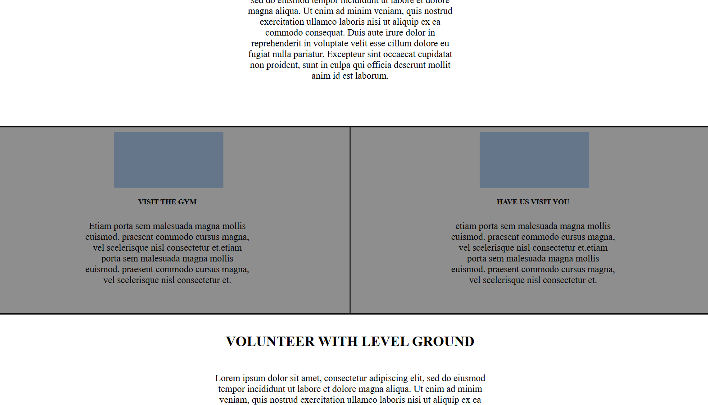

## Level Ground MMA
This website was built for a local MMA gym, Level Ground MMA, to provide an online presence  
with essential information for potential members, gym location, and contact details. 
Link to project <a href="https://dougiethedevlgmma.netlify.app">here</a>!

 
 

## Tech Used
HTML5: Structured the content of the site, including sections for the gym’s introduction, services, schedule, and contact information 
CSS3: Styled the website to be clean and professional, with a responsive layout to ensure compatibility across devices. The design was kept simple to allow easy navigation and readability. 

HTML: 
